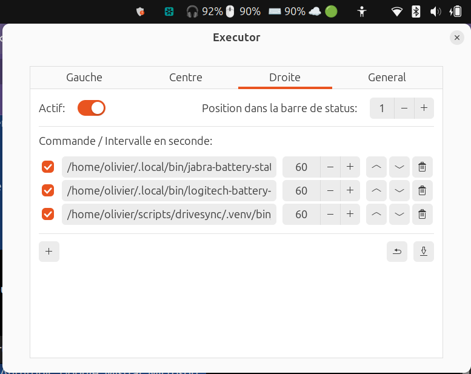

# revilofr-executors

A collection of small shell scripts to display hardware status indicators in
the GNOME system bar via the [Executor](https://extensions.gnome.org/extension/2932/executor/)
extension.

Each executor lives in its own folder under `executors/`, with its own
`README.md` (documenting its dependencies) and `prerequisites.sh` (checking,
and installing when possible, those dependencies).

Want to add your own executor? See [CONTRIBUTING.md](CONTRIBUTING.md).

## Executors

- [`executors/logitech-battery-status`](executors/logitech-battery-status/README.md) —
  battery level of a Logitech mouse and keyboard.
- [`executors/jabra-battery-status`](executors/jabra-battery-status/README.md) —
  battery level of a Jabra headset.

## Example

Combining the executors above as active commands in GNOME Executor:


The cloud icon with a colored dot (☁️ 🟢) isn't from this repo: it's the
sync health indicator from [drivesync](https://github.com/revilofr/drivesync) —
a `rclone`-based CLI (also by revilofr) that syncs local folders to Google
Drive on Linux, and ships its own Executor indicator:

```text
/home/olivier/scripts/drivesync/.venv/bin/drivesync status --executor
```

Each command is configured as an active command in the Executor preferences
(right-click the extension icon → Preferences), with an interval in seconds:



See the [Executor extension page](https://extensions.gnome.org/extension/2932/executor/)
and its [official documentation](https://github.com/aunetx/executor) for the
full list of preferences (position, columns, colors, styling) beyond what is
shown above.

## Install

```bash
./prerequisites.sh   # check/install each executor's dependencies
./install.sh          # symlink each executor script into ~/.local/bin
```

## Usage with GNOME Executor

In Executor, add an active command to the status area, pointing to the
installed script, e.g.:

```text
/home/yourname/.local/bin/logitech-battery-status
```

Set an interval (in seconds) matching how often you want the status
refreshed, e.g. 60 seconds.

See the [Executor extension page](https://extensions.gnome.org/extension/2932/executor/)
and its [official documentation](https://raujonas.github.io/executor/) for
details on adding/configuring active commands, custom colors and styling
options beyond what is shown in the example above.


